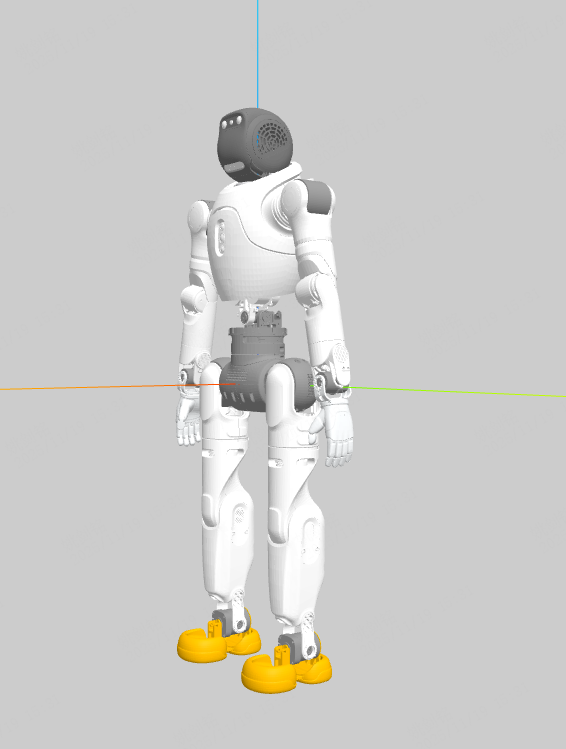
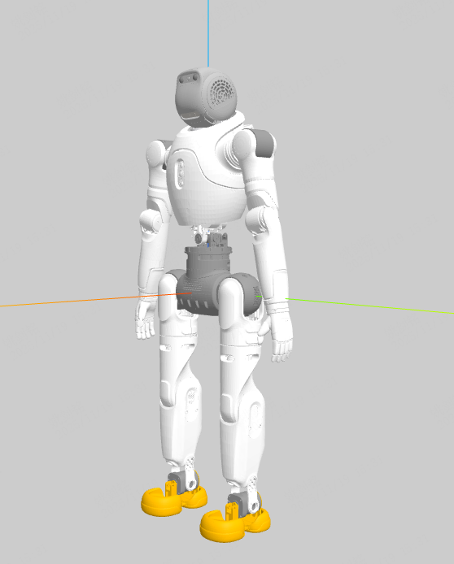
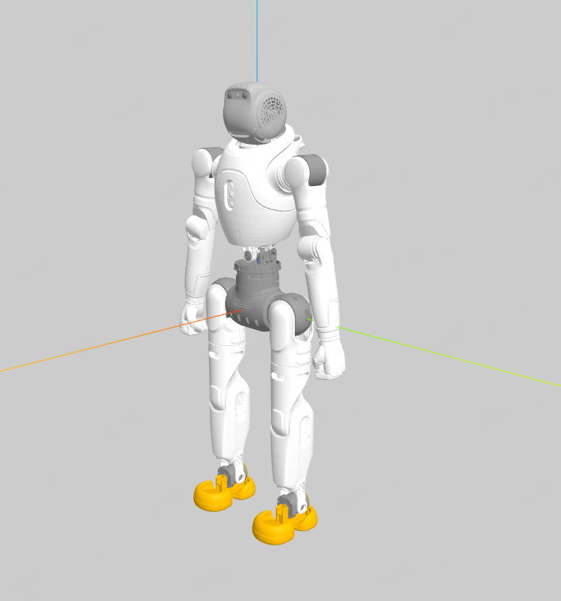

# Robot Model
## DEBUG工具
### xml && urdf
```
python -m mujoco.viewer
```
* 需要安装mujoco
```
pip install mujoco
```
### urdf
* VScode插件
``` 
# URDF Visualizer
```
## x2_ultra (plus)
<!--  -->

## x2_hand (plus)
<!--  -->

## x2_fist (plus)
<!--  -->

